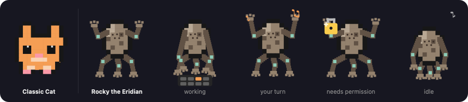

# 🐾 Rocky

A floating pixel-cat desktop pet for [Claude Code](https://claude.com/claude-code).
One animated cat sits on top of your screen; its mood tracks every Claude Code
session. Glance to know if anything needs you, click to see which and why, and
land in the right terminal tab.

Native Swift/AppKit. Single ~190 KB binary, no dependencies, near-zero CPU when
idle. macOS only.

<p align="center">
  
</p>

<p align="center"><em>🔴 needs permission · 🟢 your turn · 🔵 working · ⚪ idle</em></p>

## Why

Claude Code made it cheap to run several sessions at once — but you're still the
single scheduler they all block on, and every check costs an alt-tab. Rocky is
**peripheral vision for your agents**: notice → triage → act, without breaking
focus.

## Highlights

- **One hero cat** whose mood = your most urgent session
  (needs-permission › your-turn › working › idle); a badge counts sessions and
  turns red/green when one wants you.
- **Click to fan out** one tab per session. Each row tells the *story*, not just
  the state:
  - a **transcript peek** of what it's actually asking,
  - a **finish outcome** when a turn ends (`✓ 3 files changed · 2 commands`),
  - an **elapsed timer** with a re-nudge when a session's been blocked too long,
  - an **activity sparkline**, and a **context-window meter** that reddens as a
    session nears its limit (so you know when it's about to compact).
- **Click a tab → the exact terminal tab.** Warp, iTerm2, Terminal.app, kitty,
  VS Code, Cursor, and tmux get deep focus; others raise the app (and the tab
  says so).
- **One-key jump** — a global hotkey (default **⌥⌘R**) focuses the top session
  from anywhere, no clicking.
- **In-app alerts** — a ripple + sound when a session finishes or needs
  permission. No macOS toasts, nothing for routine tool calls, and never a ding
  for state it merely discovered on launch.
- **Space screen saver** — step away and your Mac becomes mission control.
- **Skins** — the pet doesn't have to be a cat: switch to **Rocky the Eridian**
  (*Project Hail Mary*) — a stone carapace on five legs, no eyes, talks in
  musical notes. Right-click → Skin. The pixel maps are plain text in
  [`RockyCore.swift`](RockyCore.swift); drawing a new skin is a
  [good first issue](docs/SKINS.md).
- **Tiny preferences**, all in the right-click menu — no config file, no window.
- **Local-only.** Reads two folders under `~/.claude`, sends nothing off your
  machine.

## Look

A single frosted, always-on-top widget — collapsed it's just the pet; click and
the sessions fan out. Drag it anywhere; it never steals keyboard focus.

<p align="center">
  
  
</p>

<p align="center">
  
  &nbsp;&nbsp;&nbsp;&nbsp;
  
</p>

### Skins

The pet doesn't have to be a cat. Right-click → **Skin** to switch to **Rocky
the Eridian** (*Project Hail Mary*) — rock carapace, five limbs, no eyes, and
every mood still reads at a glance: hands raised to greet you, typing when a
session works, bracing beside the padlock, folding up to sleep with a musical
note instead of a "z". The screen saver follows the same choice.

<p align="center">
  
</p>

### Away from the desk

Rocky floats in a little space helmet while your sessions orbit as planets,
colour-coded by status — a blocked session flares into a pulsing red sun that
washes the scene in warning light. Glance across the room and know if something
is stuck, without unlocking.

<p align="center">
  
</p>

## Requirements

- **macOS 12+** (Apple Silicon or Intel).
- **Xcode Command Line Tools** for `swiftc` (`xcode-select --install`).
- **Claude Code** installed.

## Install

### Homebrew (recommended)

```bash
brew install ketansomvanshi/tap/rocky
rocky-setup                 # wire Rocky into Claude Code's hooks
brew services start rocky   # launch now + at login
```

Homebrew compiles the single Swift file locally, so there's no Gatekeeper
prompt. `rocky-setup` merges Rocky's hooks into `~/.claude/settings.json`
(your existing hooks are left untouched); `rocky-teardown` removes them.

### From source

```bash
git clone https://github.com/KetanSomvanshi/rocky.git
cd rocky
./install.sh                    # add --with-screensaver to also install the saver
```

This compiles Rocky, sets it to launch at login (a `launchd` agent), and wires
the hooks. Either way, open a fresh Claude Code session (or run `/hooks`) so the
hooks load.

### Screen saver

```bash
./screensaver/build.sh --install
```

Then pick **Rocky** in System Settings → Screen Saver (universal build; reads
the same session data as the widget).

## Controls

| Action | How |
|---|---|
| Move the window | drag the pet (position is remembered) |
| Show / hide session tabs | click the pet |
| Jump to a session | click its tab |
| Jump to the top session | global hotkey (default ⌥⌘R), or right-click → Jump to Top Session |
| Mute / unmute one session | right-click its tab |
| Preferences · Launch at Login · Quit | right-click the pet |

## Preferences

Every knob lives in the right-click menu and persists in `UserDefaults` — no
config file.

| Preference | Options |
|---|---|
| **Jump Shortcut** | ⌥⌘R (default) · ⌃⌘R · ⌥⌘J · Off — global hotkey to focus the top session |
| **Alert Style** | Ripple + Sound (default) · Ripple Only |
| **Pet Size** | Small · Medium (default) · Large |
| **Skin** | Classic Cat (default) · Rocky the Eridian — applies to the widget and the screen saver |
| **Re-nudge Interval** | 1 / 2 (default) / 5 / 10 min · Never — how often a stuck session re-alerts |
| **Quiet Hours** | Off (default) · nightly windows |
| **Respect macOS Focus** | On (default) · Off — any Focus mode silences alerts (needs Full Disk Access; best-effort) |
| **Mute this session** | per-tab — stays visible, just stops alerting |

Muting only silences the *interruption* — the tab, its dot, and the stuck-pulse
stay visible. Rocky's whole point is peripheral vision, so it never goes blind,
only quiet.

## How it works

Rocky merges two local sources every 0.3s:

1. **Claude's live session registry** (`~/.claude/sessions/<pid>.json`) — the
   authoritative list of running sessions, so **every session appears with zero
   setup**. It's an undocumented internal, so a versioned adapter decodes it and
   degrades to hooks-only mode (never a blank pet) if the format drifts.
2. **Rocky's hook data** (`~/.claude/rocky/sessions/<id>.json`), written by
   `rocky-hook.py` — adds real-time detail: running tool, needs-permission,
   your-turn, finish outcomes, context estimate, and the alerts.

Hooks run `async`, so they add zero latency to Claude's turns; if Rocky isn't
running they're harmless no-ops. The right-click menu always shows whether hooks
are wired and the registry is readable, so the cat never silently vanishes.

## Click a cat → the right terminal tab

| Terminal | Focus |
|---|---|
| **Warp** | exact tab via `WARP_FOCUS_URL` |
| **iTerm2 / Terminal.app** | exact tab by tty (AppleScript) |
| **kitty** | exact window via remote control (when enabled) |
| **VS Code / Cursor** | the window showing the session's folder |
| **tmux** (in any terminal) | exact window + pane, then raises the host |
| **Ghostty / Alacritty / others** | raises the app (the tab hint says so) |

## Uninstall

```bash
rocky-teardown && brew services stop rocky && brew uninstall rocky   # Homebrew
./uninstall.sh                                                        # from source
```

Either way this stops the agent, removes Rocky's files, and strips only Rocky's
hooks from `settings.json`.

## How it's built

One `main.swift` (the widget), `RockyCore.swift` (shared sprite + session store,
used by the screen saver too), and `rocky-hook.py` (maps Claude Code hook events
to per-session state). No dependencies. Worth a read if you're curious how a
Claude Code hook can drive a native macOS UI.

## License

MIT — see [LICENSE](LICENSE).
