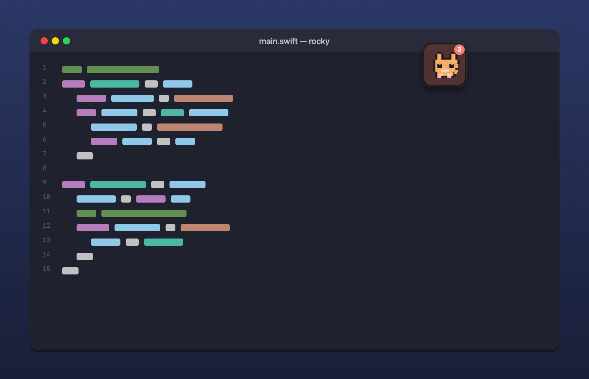
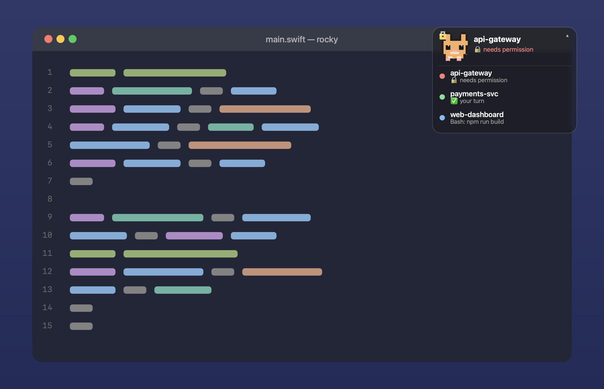
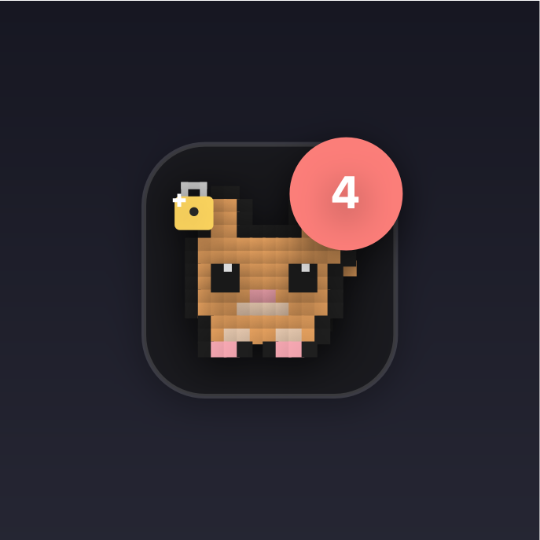
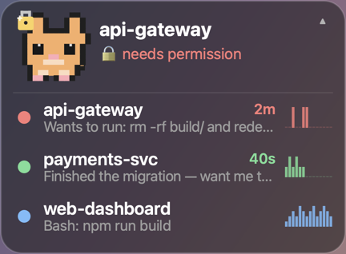
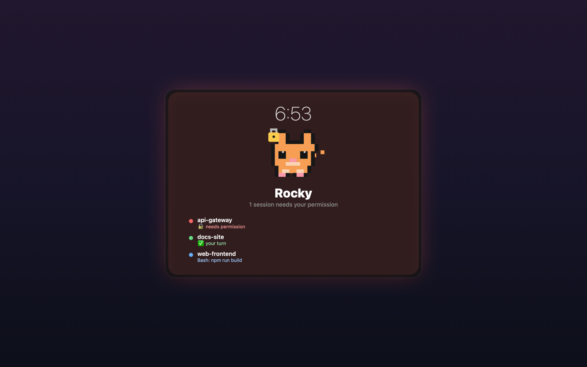

# 🐾 Rocky

A floating pixel-cat desktop pet for [Claude Code](https://claude.com/claude-code).
Rocky sits on top of your screen as a single animated cat whose mood reflects
what your Claude Code sessions are doing — click it to see every session and
jump straight to the one that needs you.

Native Swift/AppKit. Single ~190 KB binary, no dependencies, near-zero CPU when
idle. macOS only.

<p align="center">
  
</p>

<p align="center"><em>Rocky floats on top of whatever you're working in. Its mood tracks your Claude Code sessions — click it to reveal them all and jump to the one that needs you.<br>🔴 needs permission · 🟢 your turn · 🔵 working · ⚪ idle</em></p>

### It sits on top of your work

A single frosted, always-on-top widget — no window to manage, no tab to hunt for. Collapsed it's just the pet; click it and the sessions fan out.

<p align="center">
  
  
</p>

### The widget, up close

<p align="center">
  
  &nbsp;&nbsp;&nbsp;&nbsp;
  
</p>

### Even while you're away

Rocky ships an optional **screen saver** too: step away and your Mac shows the
cat, a live clock, and every session's status — with a soft glow when one needs
you. Glance across the room and know if a session is blocked, without unlocking.

<p align="center">
  
</p>

## What it does

- **One hero pet** (a ginger cat named Rocky) sits on your screen and animates
  with your overall mood — priority order: needs-permission › your-turn ›
  working › idle. A small badge shows the session count, turning red/green when
  a session needs you.
- **Moods** (hand-animated pixel art):
  - a walk cycle with a springy tail — and a tiny keyboard tapping away —
    while Claude is working
  - a happy bounce when a session finishes ("your turn")
  - a shake with a 🔒 padlock when a session needs permission
  - curls up breathing with a `z` when everything's idle, then stretches
    awake when work resumes
  - a sparkly all-clear celebration when the last busy session goes quiet
- **Click the pet** to reveal the **session tabs** — they fan out with a
  staggered animation, one row per running session with a colour-coded status
  dot (🔴 needs permission · 🟢 your turn · 🔵 working · ⚪ idle), its name, and
  status. Click a tab to jump straight to that session's terminal tab. Click
  the pet again to collapse.
- **Each tab tells the story**, not just the state:
  - a **transcript peek** of what a session is actually doing or asking
    ("Finished the migration — want me to run the tests?") when it needs you,
  - an **elapsed timer** ("needs permission · 4m"), with a stronger pulse and a
    re-nudge when a session's been blocked too long (interval tunable from the
    right-click menu — "Re-nudge Interval" — default 2 minutes, or off),
  - a tiny **activity sparkline** so busy-vs-idle is obvious at a glance,
  - a **finish outcome** — when a session ends its turn the row shows *what it
    did* ("✓ 3 files changed · 2 commands"), derived from the transcript, not
    just "your turn",
  - and a thin **context-window meter** under the row that fills and shifts
    colour (calm → amber → red) as the session's context approaches the
    model's limit — so "is this about to compact? should I wrap it up?" is
    answerable at a glance. It hides when there's no estimate yet.
- **Alerts** when a session finishes or needs permission: a colored ring
  ripples out from the pet, its row pulses with a matching glow (green = done,
  red = needs permission), and a sound plays — all in Rocky itself, no macOS
  toast/banner. Nothing fires for routine tool calls. Rocky never dings for
  state it just discovered on launch — only for things that changed while it
  was watching (see [Preferences](#preferences) to tune or silence this).
- **A tiny preferences layer**, entirely in the right-click menu — no config
  file, no settings window (see [Preferences](#preferences)).
- **Self-checks itself**: the right-click menu always shows whether hooks are
  wired and whether Claude's session registry is readable, so a silent "why
  did the cat disappear" never happens without an answer.

## Requirements

- **macOS** (Apple Silicon or Intel), macOS 12+.
- **Xcode Command Line Tools** for `swiftc` (`xcode-select --install`).
- **Claude Code** installed.
- Terminal: **Warp**, **iTerm2**, **Terminal.app**, **kitty** (with remote
  control), **VS Code**, **Cursor**, or **tmux** in any host for
  click-to-exact-tab focus (other terminals still show sessions; click
  activates the app, and the tab says so).

## Install

### Homebrew (recommended)

```bash
brew install ketansomvanshi/tap/rocky
rocky-setup                 # connect Rocky to Claude Code's hooks
brew services start rocky   # launch now + at login
```

Homebrew compiles the single Swift file locally, so there's **no Gatekeeper
"unidentified developer" prompt**. `rocky-setup` merges Rocky's hooks into
`~/.claude/settings.json` (your existing hooks, including Claude Island, are
left untouched); `rocky-teardown` removes them again.

### From source

```bash
git clone https://github.com/KetanSomvanshi/rocky.git
cd rocky
./install.sh
```

This compiles Rocky, installs it to `~/.claude/rocky/`, sets it to launch at
login (a `launchd` agent), and wires the Claude Code hooks into
`~/.claude/settings.json` (merged — your existing hooks, including Claude
Island, are left untouched).

Either way, open a fresh Claude Code session (or run `/hooks` in an existing
one) so the hooks load.

### Screen saver (optional)

To also install the screen saver, add `--with-screensaver` to the source
installer, or build it directly:

```bash
./install.sh --with-screensaver      # from source, alongside the widget
# or, standalone:
./screensaver/build.sh --install
```

Then pick **Rocky** in System Settings → Screen Saver. It's a universal
(Apple Silicon + Intel) build and reads the same session data as the widget.

## How it works

Rocky merges two sources every 0.3s:

```
1. Claude's live session registry  ~/.claude/sessions/<pid>.json
      → the authoritative list of every running session (name, cwd, status).
        This is why ALL sessions appear — no hooks required.

2. Rocky's hook data                ~/.claude/rocky/sessions/<id>.json
      ← rocky-hook.py, fired by Claude Code hook events (async)
      → adds real-time detail: which tool is running, needs-permission,
        your-turn, and the finish/permission alerts.
```

Hooks run with `"async": true`, so they add zero latency to Claude's turns, and
if Rocky isn't running they're harmless no-ops. A session shows up the moment
it's running (from the registry); hooks just make its status richer.

## Controls

| Action | How |
|---|---|
| Move the window | drag the pet anywhere (position is remembered) |
| Show / hide session tabs | click the pet |
| Jump to a session | click its tab |
| Jump to the top session | press the global hotkey (default ⌥⌘R) from anywhere, or right-click → Jump to Top Session |
| Mute / unmute one session | right-click its tab |
| Change a preference | right-click the pet (see below) |
| Launch at login | right-click → Launch at Login |
| Quit | right-click → Quit Rocky |

The window is a non-activating panel: clicking it never steals keyboard focus
from your terminal, and clicks register on the first try.

## Preferences

No config file, no settings window — every knob lives in the right-click
menu and persists the same way the window position already does
(`UserDefaults`, nothing written to disk you'd need to hand-edit).

| Preference | Options | Notes |
|---|---|---|
| **Jump Shortcut** | ⌥⌘R (default) · ⌃⌘R · ⌥⌘J · Off | Global hotkey that focuses the highest-priority session (needs-permission › your-turn › most-recent) from anywhere — the whole notice→act loop in one keystroke. Uses Carbon's hotkey API, so no Accessibility prompt. |
| **Alert Style** | Ripple + Sound (default) · Ripple Only | Turns the ding off without hiding anything — the tab still pulses and shows its state. |
| **Pet Size** | Small · Medium (default) · Large | Resizes the whole floating panel live. |
| **Re-nudge Interval** | 1 / 2 (default) / 5 / 10 min · Never | How often a stuck `needs_permission` session re-alerts. |
| **Quiet Hours** | Off (default) · 10 PM–8 AM · 11 PM–7 AM · 9 PM–9 AM | A daily window where alerts go quiet automatically. |
| **Respect macOS Focus** | On (default) · Off | Any Focus/Do Not Disturb mode silences alerts too — see caveat below. |
| **Mute this session** | per-tab, right-click a row | Stops alerting for just that one session; it stays visible with a 🔕. |

Muting — per-session, Quiet Hours, or Focus — only silences the *interruption*
(sound, ripple, auto-raising the window). The tab, its status dot, and the
"stuck" pulse stay visible; Rocky's whole point is peripheral vision, so
muting never makes a session invisible, only quiet.

> **Focus/Do Not Disturb sync is best-effort.** macOS has no public API for
> "is Focus on right now" — Rocky reads the same undocumented file several
> menu-bar utilities use (`~/Library/DoNotDisturb/DB/Assertions.json`), which
> requires **Full Disk Access** for Rocky and can change shape across macOS
> releases without notice. If it can't read the file, Rocky never assumes
> Focus is on (alerts still fire) and the right-click menu says so plainly
> ("⚠ Focus sync needs Full Disk Access for Rocky") instead of silently doing
> nothing.

## Uninstall

Homebrew:

```bash
rocky-teardown              # remove Rocky's hooks from settings.json
brew services stop rocky
brew uninstall rocky
```

From source:

```bash
./uninstall.sh
```

Either way this stops the agent, removes Rocky's files, and strips only
Rocky's hooks from `settings.json` (your other hooks are left intact).

## Clicking a cat → the right terminal tab

- **Warp**: Rocky opens the session's `WARP_FOCUS_URL`
  (`warp://session/<uuid>`), which Warp exports in every session's
  environment — it jumps to the exact tab. No permissions, no config.
- **iTerm2 / Terminal.app**: fully scriptable — Rocky selects the exact tab by
  tty.
- **kitty**: exact window via remote control, when it's enabled
  (`allow_remote_control yes` + `listen_on unix:/tmp/kitty-{kitty_pid}` in
  kitty.conf). Without it, clicking activates kitty and the tab says so.
- **VS Code / Cursor**: Rocky opens the session's folder, which these
  single-instance apps route to the window already showing that workspace.
- **tmux** (inside any terminal): Rocky selects the exact tmux window + pane,
  switches the attached client to the right session, then raises the hosting
  terminal — deep focus even in terminals with no scripting story of their own.
- **Ghostty / Alacritty / everything else**: no tab-scripting surface exists,
  so clicking activates the app. Rocky is honest about it: hovering the tab
  shows *"click focuses \<app\> only"*. (Tip: run Claude inside tmux there and
  deep focus works.)

## Which sessions show up

**Every running Claude Code session appears automatically** — Rocky reads
Claude's live session registry (`~/.claude/sessions/`), so it doesn't depend on
hooks firing. Sessions stay listed as long as their process is alive (even when
idle) and drop off when they exit. Hooks aren't needed for a session to appear;
they only enrich its status (tool names, needs-permission, your-turn alerts).

That registry is an undocumented Claude Code internal, so Rocky never trusts it
blindly: a versioned adapter decodes it, tolerating renamed fields if the
format drifts, and if it becomes unreadable entirely Rocky degrades to
**hooks-only mode** (still showing every session that's fired a hook) instead
of going blank. The right-click menu always shows the current read: "✓
Registry OK · N sessions" or a plain-language warning if something's off.

## Notes / limitations

- Logs: `/tmp/rocky.log` — includes a self-check line on launch ("Hooks
  wired?", "Registry readable?") and whenever registry health changes.
- Rocky reads `~/.claude/sessions/` and `~/.claude/rocky/sessions/` locally and
  never sends anything off your machine.
- Rocky never alerts for a state it finds already true the moment it (re)starts
  — only for things that change while it's running — so relaunching Rocky
  doesn't re-ding you for a session that's been waiting for an hour.

## How it's built

One `main.swift` (AppKit, no dependencies) plus a small Python hook. Worth a
read if you're curious how a Claude Code hook can drive a native macOS UI:

- `main.swift` — the pet: transparent non-activating panel, a hand-drawn pixel
  cat rendered with Core Graphics, and the registry⨯hook merge.
- `rocky-hook.py` — maps Claude Code hook events to per-session state files.
- `install.sh` / `uninstall.sh` — build, install the login agent, and call
  `scripts/wire-hooks.py` to wire/unwire the hooks in `settings.json`
  (idempotent; your other hooks are untouched).

## License

MIT — see [LICENSE](LICENSE).
